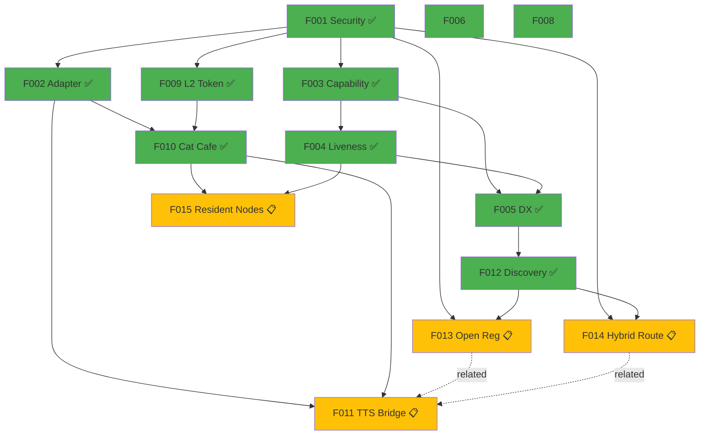
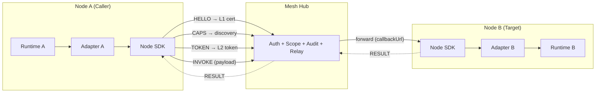
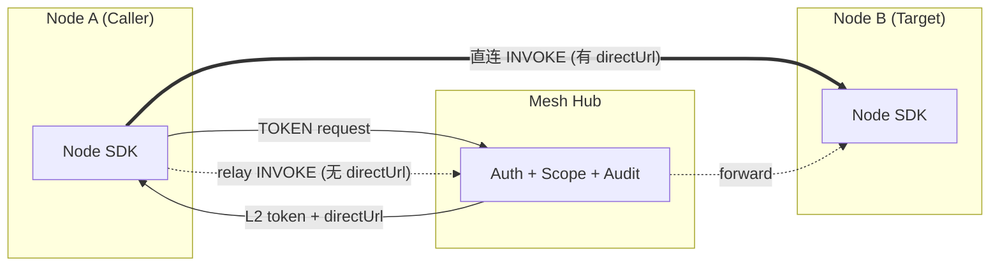
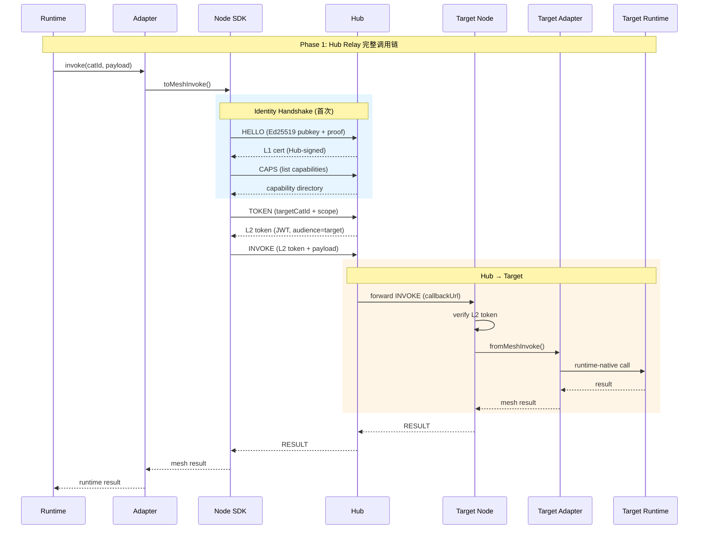

# Agent Mesh Architecture

> This document is the **architecture judgment tool** for Agent Mesh.
> It defines hard constraints, dependency rules, and the feature map.
> Every cat should read this before starting work on any feature.

## 1. Layered Architecture

```
┌─────────────────────────────────────────────────────────┐
│  Layer 4: Application                                   │
│  Concrete capability bridges and deployment artifacts   │
│  bridge-tts, bridges/qwen3-tts                          │
├─────────────────────────────────────────────────────────┤
│  Layer 3: Composition                                   │
│  Combines adapter + node into runtime-ready bridges     │
│  mesh-bridge                                            │
├─────────────────────────────────────────────────────────┤
│  Layer 2: Integration                                   │
│  Public-facing discovery, external system integration   │
│  mesh-hub (discovery endpoints), mesh-node (server)     │
├─────────────────────────────────────────────────────────┤
│  Layer 1: Governance                                    │
│  Identity, auth, policy, audit, liveness, routing       │
│  mesh-hub (core)                                        │
├─────────────────────────────────────────────────────────┤
│  Layer 0: Protocol                                      │
│  Types, constants, message definitions (zero deps)      │
│  mesh-protocol, mesh-adapter, mesh-node (client)        │
└─────────────────────────────────────────────────────────┘
```

### Package Responsibilities

| Package | Layer | Responsibility | Input | Output |
|---------|-------|---------------|-------|--------|
| mesh-protocol | 0 | Type definitions, error codes, message shapes | — | TypeScript types |
| mesh-adapter | 0 | Runtime field mapping (runtime request/result <-> mesh payload) | Runtime-native request | Mesh-standard payload |
| mesh-node | 0+2 | Client SDK (HELLO/CAPS/TOKEN/INVOKE) + Server (inbound invoke) | Hub URL + identity | Authenticated mesh calls |
| mesh-hub | 1+2 | Governance (auth, scope, replay, revoke, audit) + Relay + Discovery | Node registrations | Policy-enforced routing |
| mesh-bridge | 3 | Composes adapter + node into ready-to-use bridges | Adapter + Node config | Working bridge instance |
| bridge-tts | 4 | Qwen3-TTS capability implementation | Audio synthesis request | Audio response |

## 2. Dependency Whitelist Matrix

**Rule**: Only dependencies marked ✅ are allowed. Any new cross-layer dependency requires an ADR.

| Consumer ↓ / Provider → | protocol | adapter | node | hub | bridge | bridge-tts |
|--------------------------|----------|---------|------|-----|--------|------------|
| **mesh-adapter** | ✅ | — | ❌ | ❌ | ❌ | ❌ |
| **mesh-node** | ✅ | ❌ | — | ❌ | ❌ | ❌ |
| **mesh-hub** | ✅ | ❌ | ❌ | — | ❌ | ❌ |
| **mesh-bridge** | ✅ | ✅ | ✅ | ❌ | — | ❌ |
| **bridge-tts** | ❌ | ❌ | ✅ | ❌ | ❌ | — |
| **examples/** | ✅ | ✅ | ✅ | ✅ | ✅ | ✅ |
| **experiments/** | ✅ | ✅ | ✅ | ✅ | ✅ | ✅ |

> **Test-only exception**: Hub and Node tests may import each other for integration testing
> (e.g., Hub tests use `@agent-mesh/node` to generate identities, Node tests use `@agent-mesh/hub` to start a real Hub).
> This is allowed in `*.test.ts` files only, never in production source.

## 3. Architecture Invariants

Violating any of these is grounds for **immediate review rejection**.

### Identity & Security
1. **L0→L1→L2 identity chain is non-bypassable**. Every invoke must traverse the full chain.
2. **Hub is the sole L1/L2 token issuer** in Phase 1. No node may self-issue tokens.
3. **Revocation propagation must not degrade**. A revoked identity must not be invocable.
4. **Replay guard (jti) is mandatory** on all token-bearing requests.

### Communication Topology
5. **Hub Relay is the sole invoke path in Phase 1** (ADR 2026-04-01). All invocations follow `Node A → Hub → Node B`.
6. **Phase 2 (direct connect) requires all 4 ADR gates to pass** before activation:
   - Real traffic bottleneck evidence
   - 100% audit coverage parity
   - Revocation semantics non-degradation
   - Automatic fallback test coverage
7. **Feature specs must not override ADR gates**. Phase boundary changes require formal ADR amendment.

### Repository Layout (ADR 2026-04-02)
8. **`packages/`** = publishable, versioned npm packages.
9. **`bridges/`** = deployment wrappers, process supervisors, non-npm artifacts.
10. **`experiments/`** = throwaway prototypes. Not release-gate truth sources.
11. **Promotion path**: `experiments/` → mature → `packages/` or `bridges/`. No reverse.

### Quality
12. **Bug fix = red test first, then green**. No guess-and-patch.
13. **"Done" requires evidence** (test pass / screenshot / log).
14. **File size**: 200 lines warn, 350 hard cap.

## 4. Evolution Boundaries

### Phase 1 (Current / MVP) — What We Build

- Hub Relay only. Call chain: `Node A → Hub → Node B`.
- Static node registration via config whitelist.
- Single Hub instance, single region.
- Security: L0/L1/L2 + mTLS + revoke + replay guard.

### Phase 2 (Future) — What We Don't Build Yet

- Hybrid routing (direct URL + Hub relay fallback) — requires ADR gate pass
- Open node registration (dynamic self-registration)
- Hub horizontal scaling / multi-region
- Streaming / large payload optimization
- NAT traversal (STUN/TURN/QUIC)

### Phase Transition Rule

Phase 2 features may be **specced** in Phase 1, but implementation requires:
1. All relevant ADR gates satisfied
2. Formal ADR amendment documenting the gate clearance
3. No feature spec may unilaterally relax ADR constraints

## 5. Feature Map

> **Single owner**: Feature status is owned by the feature file's YAML frontmatter.
> BACKLOG.md and README.md reference this, but the frontmatter is the source of truth.
> Status values: `draft` → `spec` → `impl` → `review` → `complete` | `won't-do`

### By Architecture Layer

```
Application (Layer 4)
  F011 Local TTS Bridge Example      [spec]      bridge-tts       Phase 1
  F015 Resident Test Nodes           [spec]      mesh-node        Phase 1

Integration (Layer 2)
  F010 Mesh-Cat Cafe Integration     [complete]  mesh-bridge      Phase 1
  F012 Public Discovery Layer        [complete]  mesh-hub         Phase 1
  F013 Open Node Registration        [spec]      mesh-hub         Phase 2
  F014 Hybrid Routing                [spec]      mesh-hub         Phase 2

Governance (Layer 1)
  F001 Security & Identity           [complete]  mesh-hub         Phase 1
  F003 Capability Model              [complete]  mesh-hub         Phase 1
  F004 Node Liveness                 [complete]  mesh-hub         Phase 1
  F006 Observability MVP             [complete]  mesh-hub         Phase 1
  F009 L2 Token Extension            [complete]  mesh-hub         Phase 1

Protocol (Layer 0)
  F002 Plugin Adapter Dual-Stack     [complete]  mesh-adapter     Phase 1
  F005 Developer Experience          [complete]  mesh-node        Phase 1
  F007 Runtime Bridge                [won't-do]  mesh-bridge      —
  F008 Graceful Lifecycle            [complete]  mesh-hub         Phase 1
```

### Dependency Graph



Legend: ✅ complete | 📋 spec | → blocking | -.-> related

### Completion Summary

| Phase | Total | Complete | Spec | Won't-do |
|-------|-------|----------|------|----------|
| Phase 1 | 13 | 10 | 2 (F011, F015) | 1 (F007) |
| Phase 2 | 2 | 0 | 2 (F013, F014) | 0 |
| **Total** | **15** | **10** | **4** | **1** |

**MVP completion: 10/12 actionable features (83%)**

## 6. Communication Topology

### Phase 1: Hub Relay (Current)

所有调用经过 Hub 中转。Hub 同时承担治理（auth/scope/audit）和数据中继。



### Phase 2: Hybrid Routing (Future)

控制面仍走 Hub（Identity / Policy / Audit）。数据面可按节点声明选择直连或 Hub relay。



> Phase 2 启动需满足 [ADR 四门槛](decisions/2026-04-01-mesh-hub-mvp-communication-architecture.md#phase-2-启动门槛全部满足)

### 调用链详细时序



### Package 职责边界

| Package | 管什么 | 不管什么 |
|---------|--------|---------|
| **mesh-protocol** | 类型定义、错误码、消息结构 | 任何 I/O |
| **mesh-adapter** | Runtime 字段 <-> Mesh 字段映射 | 网络传输、身份 |
| **mesh-node** | 传输、身份握手、协议执行 | 治理策略、路由决策 |
| **mesh-hub** | Auth、Scope、Replay、Revoke、Audit、Routing | Runtime 适配、具体能力逻辑 |
| **mesh-bridge** | 组合 adapter + node 为即用桥 | 治理、具体能力 |
| **bridge-tts** | TTS 能力实现 | 协议细节 |

## 7. Directory Structure

```
agent-mesh/                         ← monorepo root
├── packages/
│   ├── mesh-protocol/              ← Layer 0: zero-dep types
│   ├── mesh-adapter/               ← Layer 0: runtime mapping
│   ├── mesh-node/                  ← Layer 0+2: client SDK + server
│   ├── mesh-hub/                   ← Layer 1+2: governance + relay + discovery
│   ├── mesh-bridge/                ← Layer 3: adapter + node composition
│   └── bridge-tts/                 ← Layer 4: TTS capability bridge
├── bridges/
│   └── qwen3-tts/                  ← Python deployment wrapper (non-npm)
├── examples/                       ← Usage examples (hello-world, two-node-chat, tts-bridge)
├── experiments/                    ← Prototypes (not release-gate sources)
├── docs/
│   ├── ARCHITECTURE.md             ← This file (architecture judgment tool)
│   ├── SOP.md                      ← Standard operating procedure
│   ├── features/F0xx-*.md          ← Feature specs (status source of truth)
│   ├── decisions/                   ← Architecture Decision Records
│   ├── discussions/                 ← Discussion artifacts
│   └── plans/                       ← Implementation plans
├── BACKLOG.md                      ← Active feature index (references feature files)
├── CLAUDE.md                       ← Cat session bootstrap config
└── README.md                       ← Project overview
```

## 8. Change Admission Rules

Before submitting a PR, answer these questions:

1. **Which layers does this change touch?** → Check against dependency whitelist (Section 2)
2. **Does it add a new cross-layer dependency?** → If yes, requires ADR
3. **Does it change communication topology, registration, routing, or identity semantics?** → If yes, requires ADR
4. **Does a feature spec modify Phase boundaries?** → Forbidden. Must amend ADR instead
5. **Does it affect an architecture invariant (Section 3)?** → Must have explicit justification or ADR override

### Minimum Evidence per Layer

| Layer | Required Evidence |
|-------|-------------------|
| Protocol (0) | Unit tests for type contracts |
| Governance (1) | Integration tests with real Hub + Node |
| Integration (2) | Smoke test (hello-world or two-node-chat passes) |
| Composition (3) | Bridge integration test (bridge.test.ts) |
| Application (4) | Capability-specific test + manual verification |

## 9. ADR Index

| Date | Decision | Key Constraint |
|------|----------|---------------|
| 2026-04-01 | [Hub MVP Communication Architecture](decisions/2026-04-01-mesh-hub-mvp-communication-architecture.md) | Phase 1 = Hub Relay only; Phase 2 needs 4 gates |
| 2026-04-02 | [Repo Layout Governance](decisions/2026-04-02-repo-layout-governance.md) | packages/ vs bridges/ vs experiments/ classification |

### Pending ADR Needed

- **F014 Phase 2 Gate Override**: 铲屎官 judged "有公网 URL 就应该能直连" which conflicts with ADR gate 1 ("real traffic bottleneck required"). Needs formal ADR amendment before F014 implementation.
