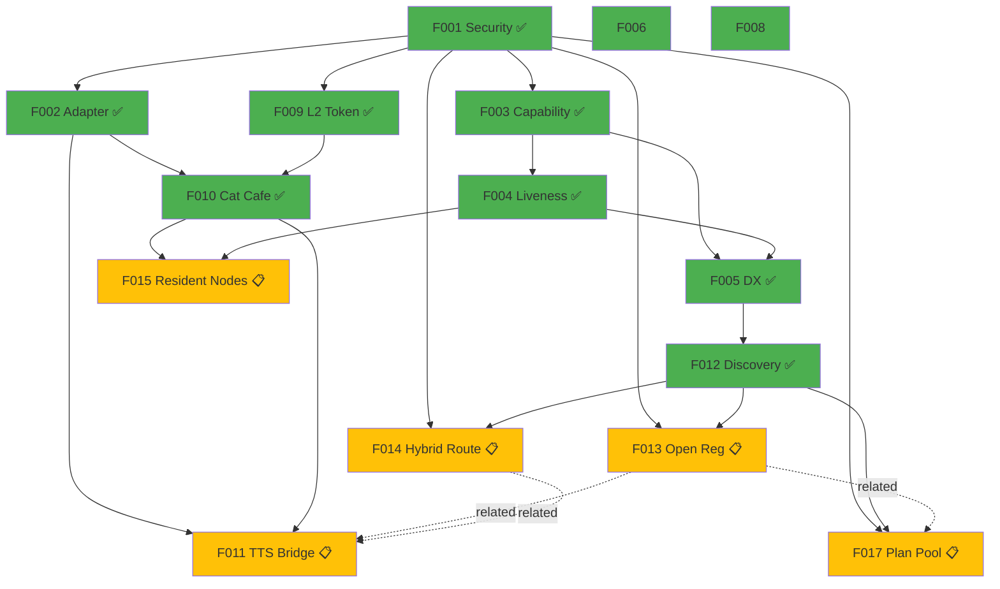
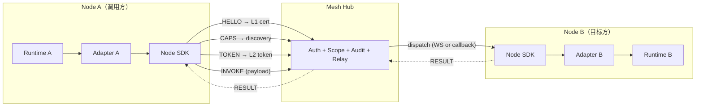
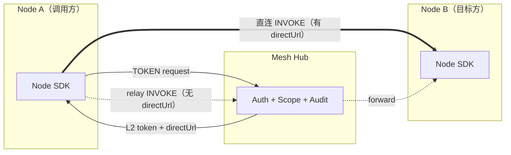
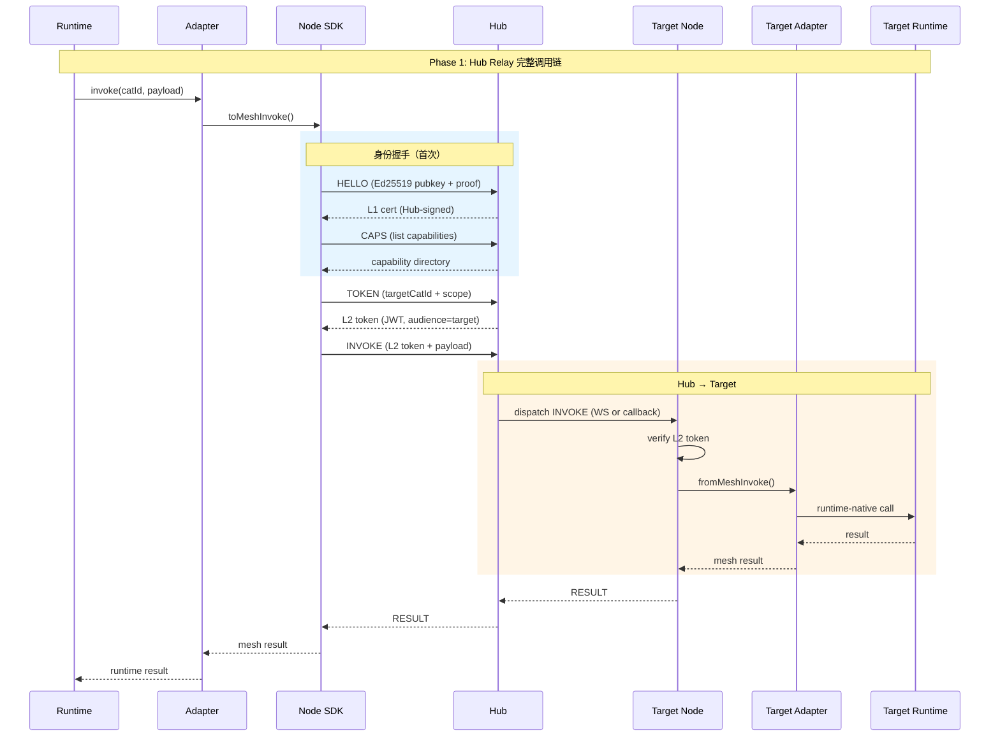

# Agent Mesh 架构全景图

> 本文档是 Agent Mesh 的**架构判定器**。
> 它定义硬约束、依赖规则和 Feature Map。
> 任何猫在开始 feature 工作前都应该先读它。
> 英文版：[`docs/ARCHITECTURE.md`](ARCHITECTURE.md)
> 同步规则：英文版和中文版必须在同一个 commit 中一起更新。
> Mermaid 提示：GitHub 和 VS Code Markdown Preview 会渲染图表；普通浏览器直接打开 Markdown 通常只会显示 Mermaid 源码。

## 1. 分层架构

```
┌─────────────────────────────────────────────────────────┐
│  Layer 4: Application                                   │
│  具体能力桥与部署制品                                   │
│  bridge-tts, bridges/qwen3-tts                          │
├─────────────────────────────────────────────────────────┤
│  Layer 3: Composition                                   │
│  把 adapter + node 组合成可直接接 runtime 的桥          │
│  mesh-bridge                                            │
├─────────────────────────────────────────────────────────┤
│  Layer 2: Integration                                   │
│  对外发现、外部系统接入                                 │
│  mesh-hub (discovery endpoints), mesh-node (server)     │
├─────────────────────────────────────────────────────────┤
│  Layer 1: Governance                                    │
│  身份、鉴权、策略、审计、存活、路由                     │
│  mesh-hub (core)                                        │
├─────────────────────────────────────────────────────────┤
│  Layer 0: Protocol                                      │
│  类型、常量、消息定义（零依赖）                         │
│  mesh-protocol, mesh-adapter, mesh-node (client)        │
└─────────────────────────────────────────────────────────┘
```

### Package 职责表

| Package | 层级 | 职责 | 输入 | 输出 |
|---------|------|------|------|------|
| mesh-protocol | 0 | 类型定义、错误码、消息结构 | — | TypeScript types |
| mesh-adapter | 0 | Runtime 字段映射（runtime request/result <-> mesh payload） | runtime-native request | mesh-standard payload |
| mesh-node | 0+2 | Client SDK（HELLO/CAPS/TOKEN/INVOKE）+ Server（inbound invoke） | Hub URL + identity | authenticated mesh calls |
| mesh-hub | 1+2 | 治理（auth/scope/replay/revoke/audit）+ Relay + Discovery | node registrations | policy-enforced routing |
| mesh-bridge | 3 | 组合 adapter + node，产出可即用 bridge | adapter + node config | working bridge instance |
| bridge-tts | 4 | Qwen3-TTS 能力实现 | audio synthesis request | audio response |

## 2. 依赖白名单矩阵

**规则**：只有标为 ✅ 的依赖是允许的。任何新增跨层依赖都需要 ADR。

| 消费方 ↓ / 提供方 → | protocol | adapter | node | hub | bridge | bridge-tts |
|---------------------|----------|---------|------|-----|--------|------------|
| **mesh-adapter** | ✅ | — | ❌ | ❌ | ❌ | ❌ |
| **mesh-node** | ✅ | ❌ | — | ❌ | ❌ | ❌ |
| **mesh-hub** | ✅ | ❌ | ❌ | — | ❌ | ❌ |
| **mesh-bridge** | ✅ | ✅ | ✅ | ❌ | — | ❌ |
| **bridge-tts** | ❌ | ❌ | ✅ | ❌ | ❌ | — |
| **examples/** | ✅ | ✅ | ✅ | ✅ | ✅ | ✅ |
| **experiments/** | ✅ | ✅ | ✅ | ✅ | ✅ | ✅ |

> **仅测试例外**：Hub 和 Node 的测试可以互相 import 以做集成测试
> （例如 Hub 测试用 `@agent-mesh/node` 生成身份，Node 测试用 `@agent-mesh/hub` 启真实 Hub）。
> 这个例外只允许出现在 `*.test.ts`，绝不允许进入生产源码。

## 3. 架构不变量

违反以下任何一条，都应被**直接驳回 review**。

### 身份与安全
1. **L0→L1→L2 身份链路不可绕过**。每次 invoke 都必须走完整链路。
2. **Phase 1 中 Hub 是唯一的 L1/L2 token 签发者**。任何 node 都不能自签 token。
3. **撤销传播语义不可退化**。被撤销身份不得继续被调用。
4. **Replay guard（jti）在所有携带 token 的请求上都是必选项**。

### 通讯拓扑
5. **Hub Relay 是 Phase 1 唯一的 invoke 路径**（ADR 2026-04-01）。所有调用都遵循 `Node A → Hub → Node B`。
6. **Phase 2（直连）只有在 ADR 四门槛全部满足后才能启动**：
   - 有真实流量瓶颈证据
   - 审计覆盖保持 100% 对齐
   - 撤销语义不退化
   - 自动回退路径有测试覆盖
7. **Feature spec 不得私自覆盖 ADR 门槛**。Phase 边界变化必须走正式 ADR 修订。

### 仓库布局（ADR 2026-04-02）
8. **`packages/`** = 可发布、可版本化的 npm package。
9. **`bridges/`** = 部署包装层、进程管理、非 npm 制品。
10. **`experiments/`** = 原型验证，不是 release gate 真相源。
11. **晋升路径**：`experiments/` → 成熟 → `packages/` 或 `bridges/`。不允许反向退回。

### 质量
12. **Bug 修复 = 先红测，再修绿**。禁止猜测式修补。
13. **“完成”必须带证据**（测试 / 截图 / 日志）。
14. **文件体积规则**：200 行预警，350 行硬上限。

## 4. 演进边界

### Phase 1（当前 / MVP）我们做什么

- 只做 Hub Relay。调用链固定为 `Node A → Hub → Node B`。
- 只支持静态白名单式节点注册。
- 单 Hub、单 Region。
- 安全基线：L0/L1/L2 + mTLS + revoke + replay guard。

### Phase 2（未来）当前不做什么

- 混合路由（direct URL + Hub relay fallback）——需先过 ADR 门禁
- 开放节点注册（动态 self-registration）
- Hub 横向扩展 / 多 Region
- 流式 / 大 payload 优化
- NAT 穿透（STUN/TURN/QUIC）

### Phase 切换规则

Phase 2 的 feature 可以在 Phase 1 先写 spec，但开始实现前必须满足：
1. 相关 ADR 门槛已满足
2. 有正式 ADR 修订，记录门槛已清除
3. 任何 feature spec 都不能单方面放宽 ADR 约束

## 5. Feature Map

> **单一 owner**：Feature 状态由 feature 文件 YAML frontmatter 持有。
> `BACKLOG.md` 和 `README.md` 只做引用，但 frontmatter 才是真相源。
> 状态值：`draft` → `spec` → `impl` → `review` → `complete` | `won't-do`

### 按架构层组织

```
Application (Layer 4)
  F011 Local TTS Bridge Example      [spec]      bridge-tts       Phase 1
  F015 Resident Test Nodes           [spec]      mesh-node        Phase 1
  F017 Plan Pool                     [spec]      plan-pool        Phase 1.5

Integration (Layer 2)
  F010 Mesh-Cat Cafe Integration     [complete]  mesh-bridge      Phase 1
  F012 Public Discovery Layer        [complete]  mesh-hub         Phase 1
  F013 Open Node Registration        [spec]      mesh-hub         Phase 2
  F014 Hybrid Routing                [spec]      mesh-hub         Phase 2

Governance (Layer 1)
  F001 Security & Identity           [complete]  mesh-hub         Phase 1
  F003 Capability Model              [complete]  mesh-hub         Phase 1
  F004 Node Liveness                 [complete]  mesh-hub         Phase 1
  F006 Observability MVP             [complete]  mesh-hub         Phase 1
  F009 L2 Token Extension            [complete]  mesh-hub         Phase 1

Protocol (Layer 0)
  F002 Plugin Adapter Dual-Stack     [complete]  mesh-adapter     Phase 1
  F005 Developer Experience          [complete]  mesh-node        Phase 1
  F007 Runtime Bridge                [won't-do]  mesh-bridge      —
  F008 Graceful Lifecycle            [complete]  mesh-hub         Phase 1
```

### 依赖图



图例：✅ complete | 📋 spec | → blocking | -.-> related

### 完成度统计

| Phase | 总数 | Complete | Spec | Won't-do |
|-------|------|----------|------|----------|
| Phase 1 | 13 | 10 | 2 (F011, F015) | 1 (F007) |
| Phase 1.5 | 1 | 0 | 1 (F017) | 0 |
| Phase 2 | 2 | 0 | 2 (F013, F014) | 0 |
| **Total** | **16** | **10** | **5** | **1** |

**MVP 完成度：10/12 个可执行 feature（83%）**

## 6. 通讯拓扑

### Phase 1：Hub Relay（当前）

所有调用都经过 Hub 中转。Hub 同时承担治理（auth / scope / audit）和数据 relay。



### Phase 2：Hybrid Routing（未来）

控制面依然经过 Hub（Identity / Policy / Audit）。数据面可根据节点声明决定走直连或 Hub relay。



> Phase 2 启动前，必须满足 [ADR 四门槛](decisions/2026-04-01-mesh-hub-mvp-communication-architecture.md#phase-2-启动门槛全部满足)

### 调用链详细时序



### Package 边界

| Package | 管什么 | 不管什么 |
|---------|--------|---------|
| **mesh-protocol** | 类型定义、错误码、消息结构 | 任何 I/O |
| **mesh-adapter** | Runtime 字段 <-> Mesh 字段映射 | 网络传输、身份 |
| **mesh-node** | 传输、身份握手、协议执行 | 治理策略、路由决策 |
| **mesh-hub** | Auth、Scope、Replay、Revoke、Audit、Routing | Runtime 适配、具体能力逻辑 |
| **mesh-bridge** | 组合 adapter + node 为即用 bridge | 治理、具体能力 |
| **bridge-tts** | TTS 能力实现 | 协议细节 |

## 7. 目录结构

```
agent-mesh/                         ← monorepo root
├── packages/
│   ├── mesh-protocol/              ← Layer 0: zero-dep types
│   ├── mesh-adapter/               ← Layer 0: runtime mapping
│   ├── mesh-node/                  ← Layer 0+2: client SDK + server
│   ├── mesh-hub/                   ← Layer 1+2: governance + relay + discovery
│   ├── mesh-bridge/                ← Layer 3: adapter + node composition
│   └── bridge-tts/                 ← Layer 4: TTS capability bridge
├── bridges/
│   └── qwen3-tts/                  ← Python deployment wrapper (non-npm)
├── examples/                       ← 使用示例（hello-world, two-node-chat, tts-bridge）
├── experiments/                    ← 原型（不是 release-gate 真相源）
├── docs/
│   ├── ARCHITECTURE.md             ← 英文架构判定器
│   ├── ARCHITECTURE.zh-CN.md       ← 中文架构判定器
│   ├── SOP.md                      ← 标准作业流程
│   ├── features/F0xx-*.md          ← Feature specs（状态真相源）
│   ├── decisions/                  ← Architecture Decision Records
│   ├── discussions/                ← Discussion artifacts
│   └── plans/                      ← Implementation plans
├── BACKLOG.md                      ← Active feature index（引用 feature files）
├── CLAUDE.md                       ← 猫会话 bootstrap 配置
└── README.md                       ← 项目总览
```

## 8. 变更准入规则

提交 PR 前，先回答这 5 个问题：

1. **这次改动触达了哪些层？** → 对照第 2 节依赖白名单
2. **有没有新增跨层依赖？** → 如果有，必须补 ADR
3. **有没有改变通讯拓扑、注册、路由、身份语义？** → 如果有，必须补 ADR
4. **Feature spec 是否修改了 Phase 边界？** → 禁止，必须改 ADR
5. **是否触碰第 3 节的不变量？** → 必须有明确论证或 ADR 豁免

### 每层最小证据要求

| 层级 | 最低证据 |
|------|----------|
| Protocol (0) | 类型契约单测 |
| Governance (1) | 真实 Hub + Node 的集成测试 |
| Integration (2) | smoke test（hello-world 或 two-node-chat） |
| Composition (3) | bridge integration test（bridge.test.ts） |
| Application (4) | 能力专项测试 + 手工验证 |

## 9. ADR 索引

| 日期 | 决议 | 关键约束 |
|------|------|----------|
| 2026-04-01 | [Hub MVP Communication Architecture](decisions/2026-04-01-mesh-hub-mvp-communication-architecture.md) | Phase 1 = Hub Relay only；Phase 2 需要四道门槛 |
| 2026-04-02 | [Repo Layout Governance](decisions/2026-04-02-repo-layout-governance.md) | `packages/` / `bridges/` / `experiments/` 的归类规则 |

### 待补 ADR

- **F014 Phase 2 Gate Override**：铲屎官提出“有公网 URL 就应该能直连”，这与 ADR 中“必须先有真实流量瓶颈”存在冲突。在 F014 开始实现前，必须先补正式 ADR 修订。
