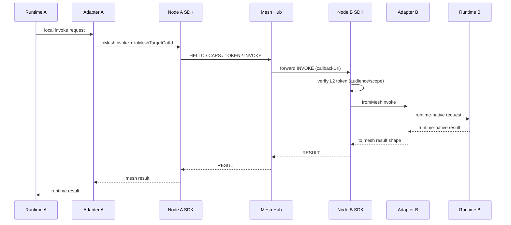

# Agent Mesh MVP Practical Runbook

## Goal

Run the current MVP end-to-end with reproducible commands and observable evidence.

This runbook is for **operation verification**, not feature development.

## Scope

In scope:
- Hub Relay path (`Node A -> Hub -> Node B`)
- Identity and token flow (`HELLO -> CAPS -> TOKEN -> INVOKE`)
- Runtime evidence (logs + trace IDs + result payload)

Out of scope:
- New feature implementation
- Topology changes (P2P data path, federation split)

## One-Page Sequence (Node / Adapter / Hub)



Boundary summary:
- `mesh-node`: transport + identity + protocol execution (`HELLO/CAPS/TOKEN/INVOKE`)
- `mesh-adapter`: runtime field mapping (runtime request/result <-> mesh payload/result)
- `mesh-hub`: governance and relay (auth, scope, replay, revocation, audit, routing)

## Preconditions

- Node.js >= 20
- pnpm 10
- clean build artifacts recommended

## Command Checklist

### 1) Build workspace

```bash
pnpm install
pnpm build
```

### 2) Run hello-world smoke

```bash
node examples/hello-world/dist/run.js
```

Expected signals:
- Hub starts on random local port
- caller/echo nodes complete `HELLO`
- `CAPS` returns two capabilities with `online` status
- `INVOKE` returns `Result: Echo: Hello from the mesh!`
- output includes a `Trace: <uuid>`

### 3) Run two-node-chat smoke

```bash
node examples/two-node-chat/dist/run.js
```

Expected signals:
- Hub starts
- Alice and Bob both complete `HELLO`
- capability list includes both cats and skills
- Alice->Bob and Bob->Alice invocations both return success payload
- output ends with `Chat complete!`

## Evidence Snapshot (2026-04-01)

Validated on local run:
- `node examples/hello-world/dist/run.js` ✅
- `node examples/two-node-chat/dist/run.js` ✅

Representative indicators observed:
- `TOKEN_ISSUED` log emitted by Hub
- `INVOKE_SENT` / `INVOKE_RESULT` log pairs emitted with same traceId
- non-empty invocation `traceId` in both examples

## Optional Targeted Verification

For focused regression checks:

```bash
pnpm --filter @agent-mesh/hub exec node --test dist/capability-model.test.js
pnpm --filter @agent-mesh/hub exec node --test dist/node-liveness.test.js
pnpm --filter @agent-mesh/hub exec node --test dist/observability.test.js
```

## Known Drift to Track

- Node INVOKE e2e tests currently have expectation drift against liveness semantics:
  - current Hub behavior returns `503 NODE_OFFLINE` when target has no fresh liveness signal
  - some invoke e2e assertions still expect pre-liveness behavior (success/timeout)
- This does not block MVP practical demo path, but should be aligned before final release gate.

## Release Gate Suggestion (MVP PASS)

Mark MVP practical gate as pass only when all are true:

1. hello-world smoke passes
2. two-node-chat smoke passes
3. targeted Hub tests above pass
4. docs are synced (`README`, `BACKLOG`, feature specs, architecture decision)
